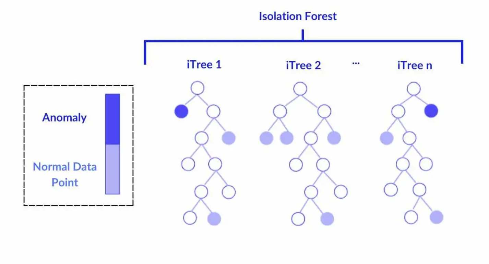
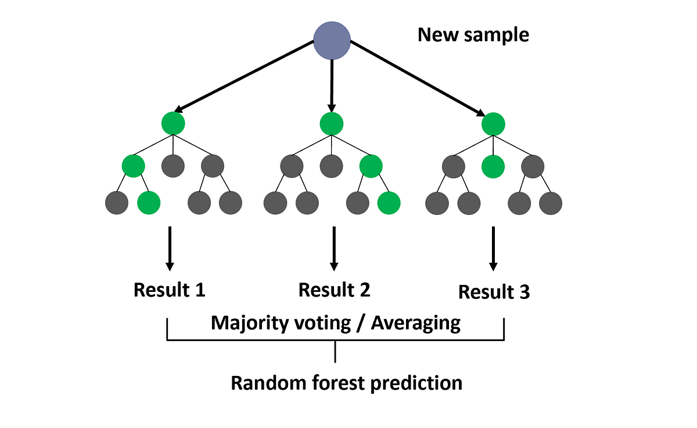
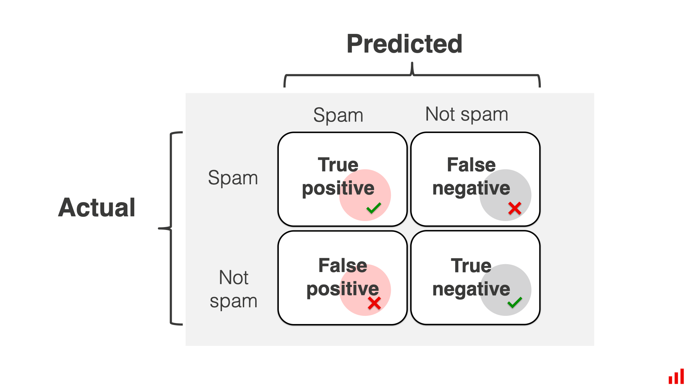
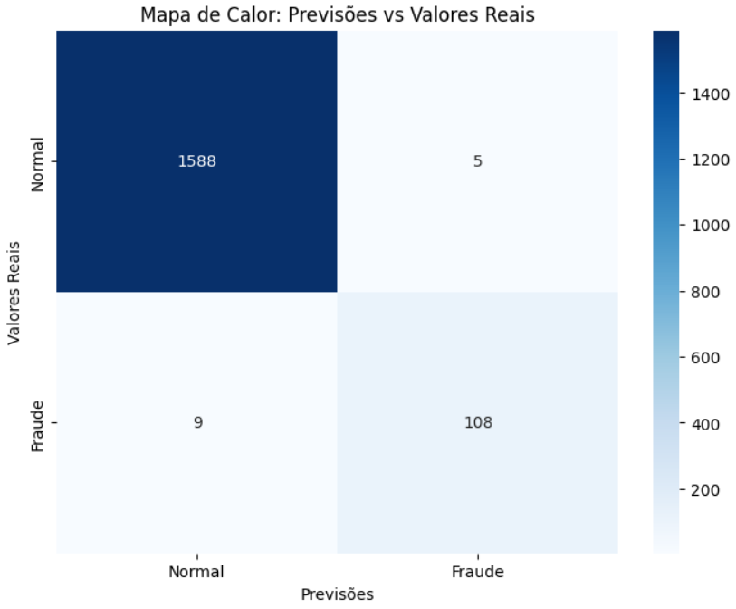

# **Projeto-C318: Detecção de Fraudes e Anomalias com Modelos Semi-Supervisionados** 🚨💳

<p align="center">
  
</p>

**Participantes do Projeto:** Lucas Cinquetti Moreira, Carl Betsa Costa, Arthur de Paula Assis e Raphael Henrique de Oliveira Centenário 

## **Sobre o Projeto**
Este projeto utiliza o famoso dataset `Creditcard.csv`, que contém dados de várias transações bancárias realizadas em bancos europeus. O objetivo é detectar fraudes e anomalias nessas transações usando uma combinação de técnicas de aprendizado de máquina supervisionadas e não supervisionadas.

As variáveis no dataset estão anonimizadas (V1, V2, V3, ..., V28) por questões de segurança, devido à natureza sensível dos dados bancários. Apesar disso, o dataset já possui uma coluna `target`, que identifica transações legítimas e fraudulentas, permitindo a criação de modelos eficazes.

<p align="center">
  
</p>

---

## **Etapas do Projeto**
### **1. Pré-Processamento**
- Utilizamos o **PCA (Principal Component Analysis)** para reduzir a dimensionalidade do dataset de 28 para 20 variáveis.
- Benefícios:
  - Redução do ruído nos dados.
  - Aumento da precisão e eficiência dos modelos.

---

### **2. Modelos Utilizados**
#### **Primeiro Modelo: Isolation Forest 🌲**
- Tipo: Não supervisionado.
- Função: Identificar outliers (possíveis fraudes) com base em árvores de decisão.
- O modelo segmenta anomalias nos primeiros níveis das árvores (itrees), permitindo identificar padrões suspeitos.

<p align="center">
  
</p>

#### **Segundo Modelo: Random Forest 🌳**
- Tipo: Supervisionado.
- Função: Refinar a classificação de anomalias usando a coluna `target` como referência.
- Trabalha em conjunto com o Isolation Forest para reduzir falsos positivos e falsos negativos.

<p align="center">
  
</p>

---

### **3. Métricas de Avaliação**
Utilizamos as métricas **Precision** (precisão) e **Recall** (revocação) para avaliar o desempenho dos modelos:
- **Precision**: Proporção de verdadeiros positivos em relação ao total de positivos preditos (evitar falsos positivos).
- **Recall**: Proporção de verdadeiros positivos em relação ao total de positivos reais (evitar falsos negativos).

#### **Resultados**
| Modelo                       | Precision | Recall |
|------------------------------|-----------|--------|
| **Isolation Forest**         | 0.07      | 0.85   |
| **Random Forest (Refinado)** | 0.96      | 0.92   |

<p align="center">
  
</p>

Ao final, geramos uma **matriz de decisão** que demonstra a distribuição de falsos positivos, falsos negativos, verdadeiros positivos e verdadeiros negativos.

<p align="center">
  
</p>

---

## **Conclusão**
- **Isolation Forest** é excelente para uma detecção inicial de anomalias, mas carece de refinamento.
- **Random Forest** complementa o processo, refinando a detecção e minimizando erros.
- A combinação desses dois modelos provou ser eficaz para detecção de fraudes bancárias.

---

## **Como Executar o Projeto**
1. Clone o repositório:
   ```bash
   git clone https://github.com/seu-repositorio/projeto-c318.git
2. Execute o notebook:
    ```bash
    jupyter notebook Projeto.ipynb

